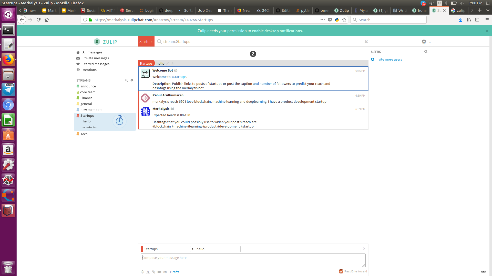

# Merkalysis

## What is Merkalysis
Merkalysis is a basically a Marketing Tool. Merkalysis stands market analysis. 
Through this tool we are trying to reduce costs of marketing for small scale startups and bloggers. 
This tool can be used by anyone as it predicts the reach and perhaps the right hashtags to use for your post. 
Currently this works only for Instagram. We'll be expanding this soon.

## When was this made?
Hack performed during MS-Hacks 2.0 at LPU, Phagwara, Punjab.

## Why Merkalysis?
As mentioned above, merkalysis helps one to analyse their market reach before hand. This could potetntially save thousands of dollars every year as marketing is something that every company and/or blogger, especially small scale startups and bloggers do in order to increase their brand awareness. 
Marketing is something that will never die. Through Merkalysis, we provide easier marketing solutions. More precisely, we focus on organic marketing, i.e marketing without having to pay money over inorganic marketing. 
Usually people turn towards social media marketing. Not always do they get the reach that is promised to them. Sometimes, just to meet their targets, these social media platforms turn to clickfarms to have the post reached to the promised number which is unfair for the advertiser. Also, as mentioned earlier, this eats away a lot of money. 
Merkalysis predicts your market reach before hand.
### But How?
We make use of organic marketing techniques, like for example, usage of hashtags. Hashtags are powerful marketing tools through which you can reach the right audience not just in one particular region, but throughout the world. 
Not everyone uses hashtags in today's world. We look at promoting the usage of hashtags to reach a wider range of audience. 
We basically analyse the hashtags that you use. 
Through the hashtags that you use, we predict your reach. 
This might help you as it serves as the right tool for you to make your business related decisions. 

### An Extension To This !!!!
Through a given caption and photo, we predict your hashtags. We try our level best to predict the hashtags you use in such a way that it increases you reach! 
Sounds cool right? :heart:  

## Integrations

## Zulip

 
Currently, Merkalysis has an active Zulip integration where one can simply join the server. <a href="https://merkalysis.zulipchat.com">This</a> is the organisation url. You can join this organisation for the following reasons: 
- You can publicize your post to a bigger crowd with many people sharing the same interest as your post.
- You can use the functionality of predicting the reach and getting hashtags on Zulip itself.
- You can also view posts of other people and this, on the whole, would be like an organic marketing group.
- You have dedicated channels here, so one can post the link of their posts in the dedicated channels (like tech, finance, etc). 

#### How to use the bot's functionality on Zulip?

To use the bot on Zulip to predict your reach and also hashtags that possibly might be good for your post, use the following command: 

    merkalysis reach <num_followers> <caption>
    Example : merkalysis reach 500 I love machine learning and blockchain. I have my own product development startup.
   
 
That's it! Too Simple maybe? :smile:

## Merkalysis API

Merkalysis now has an API that one can use in order to utilise the functionalities of this tool in your apps. 
For now, you can call the API for 3 different purposes. 

- To predict only the reach given the number of followers or friends you have

        sending a request to "localhost:8000/api/followers=<num_of_followers_or_friends>"
        returns the reach predicted by the current model
        
- To predict only the hashtags given a particular caption

        sending a request to "localhost:8000/api/caption=<caption>"
        returns hashtags that could possibly used in your posts

- To predict both, the reach and hashtags, given the followers or number of friends and caption respectively.

        ending a request to "localhost:8000/api/followers=<num_of_followers_or_friends>/caption=<caption>"
        returns the reach predicted by the current model and hashtags that could possibly used in your posts
        
 The API can be used by anyone and is free to use for the time being. We might make it paid after a while. 
 One need not use a private key to access the API for now. You just need to send requests to the mentioned URLs and the response will be got in JSON format. 

